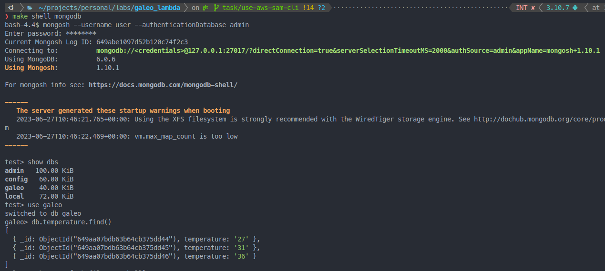

# Galeo Lambda function

## Prerequisites

Before messing up with the code get yourself ready with all the tooling needed, otherwise you will end up crying and pulling your hair out.

1. Python ^3.10
2. [Poetry](https://python-poetry.org) or whatever tool to manage virtual environments
3. pymongo

__Tip__: If you need to manage different python versions, I would recommend you to use [pyenv](https://github.com/pyenv/pyenv) 

Choose the python version desired and install it, for example:
```bash
pyenv install 3.10.7
```

## Installation

To install project dependencies execute the following commands:

```bash
poetry install
```

Or, if you don't use Poetry

```bash
pip install -r requirements.txt
```

## Usefull make commands
- target: help - Display callable targets
- target: logs - Show live logs
- target: shell <service> - open a shell in the specified service container
- target: test - Run all available test (exclude load tests)
- target: deps - create the requirements.txt from the pyproject.toml
- target: build - Build the lambda function image.
- target: run - Run the lamba function and mongoDB containers
- target: down - Stop and Remove the lamba function and mongoDB containers
- target: invoke - Invoke the lambda function locally.
- target: mongo-init - Check that your Mongo database is working by inserting a test document.

## Quick start

The Lambda function deployed locally work almost the same as a lambda function running in AWS. 
By running it locally, we can test its behavior together with other components, in this case, a NoSQL database. 

This challenge ask for saving the processed data into DynamoDB which is NoSQL AWS database, but in order to be able to test the processing process (a very very simple one) and the data saving process, we are going to use a MongoDB instance(or DocumentDB in AWS), which is also a NoSQL database, to save the data.

### Build the Lambda function image to use it locally

This time, were are not going to deploy the lambda function. We are going
to deploy it locally and test it. For this, first, we you need to build the Docker image.

```bash
docker build -t galeo-lambda .
```

### Start the project

To start the project, first, check the the `.env_example` file an copy its content. Then create an `.env` file, paste the content and fill the variables.

Once you have a prover `.env` file, you can start the project jus by running:

```bash
make run
```

if you dont have 'make' then source you `.env` and run 
```bash
docker compose up -d 
```

This action will create bouth the lambda function container and mongodb.
If you want to know that your MongoDB container is properly configured and functional you can run:

```bash
make mongo_init or python scripts/init_db.py
```

This basically, insert an initial value in the database "galeo" within the colletion "temperature".

```python 
{ _id: ObjectId("6499baa7e98d6080a2ecfbe1"), temperature: '0' }
```

### Lambda function invokation example


To invoke you lambda function ([AWS - Deploy Python Lambda functions with container images](https://docs.aws.amazon.com/lambda/latest/dg/python-image.html#python-alt-test)) we are gonig to use `curl` but you can use postman or insomnia to perform the invocation, it's just a simple POST request.

For this you can use:

```bash
make invoke
```

Under the hood this command executes:

```bash
curl --header "Content-Type: application/json" --request POST "http://localhost:9000/2015-03-31/functions/function/invocations" --data @events/event.json
```
In case you want to run it manually. 

As you can see, we are, actually, using an 'event' that contains the following data

```python
{
  "body": {"data": [{"temperature": "27"}, {"temperature": "31"}, {"temperature": "36"}]},
  ...
}
```

You should see somethid like the following:
```python
{"isBase64Encoded": false, "statusCode": 200, "body": "Data has been successfully processed and saved.", "headers": {"content-type": "application/json"}}
```

## Check the invocation result

To be sure that the lambda function invokation works, just check that the data was inserted in the database. For this, open an interactive terminal for the MongoDB container:

```bash
make shell mongodb
```
Or 
```bash
docker exec -it mongodb bash
```

After that, login into the database by running:

```bash
mongosh --username user --authenticationDatabase admin
```
Then follow the next steps:

```bash
use galeo
```

```bash
db.temperature.find()
```

You should see something like this:

```python
[
  { _id: ObjectId("649aa07bdb63b64cb375dd44"), temperature: '27' },
  { _id: ObjectId("649aa07bdb63b64cb375dd45"), temperature: '31' },
  { _id: ObjectId("649aa07bdb63b64cb375dd46"), temperature: '36' }
]
```

AS you can see the data inside the Event used to invoke the Lamda function was inserted sucessfully.




